# **Dự án bài tập lớn: Game Treasure**

### Họ và tên: MAi Tấn Trung 
- MÃ Sinh Viên: 23020713
- Lớp: K68J 
- INT2215 52

# Mục lục
- [**Game Treasure**](#Fireboy-and-Watergirl-Adventure)
    - [**Video Demo**](#Video-demo)
    - [***Cách tải game***](#Cách-tải-gamegame)
    - [**Giới thiệu game**](#Giới-thiệu-game)
    - [**Hướng dẫn chơi**](#Hướng-dẫn-chơi)
    - [**Các thành phần trong game**](#Các-thành-phần-trong-game)
    - [**Chiến thắng và thất bại**](#Chiến-thắng-và-thất-bại)
    - [**Cấu trúc game**](#Cấu-trúc-game)
    - [**Đồ họa**](#Về-đồ-họa)
    - [**Nguồn tham khảo**](#Nguồn-tham-khảo)
    
# 1. Video Demo
# 2. Giới thiệu game

- *Game Treasure* trò chơi bắn súng tìm kho báu là một thể loại game hấp dẫn kết hợp giữa hành động bắn súng và mạo hiểm tìm kiếm kho báu. 

- Các trò chơi này thường đưa người chơi vào những cuộc phiêu lưu đầy thử thách, nơi bạn cần sử dụng cả kỹ năng chiến đấu và khả năng giải đố để tìm kiếm kho báu

# 3. Cách tải game

## Bước 1: Bạn truy cập link github: https://github.com/kimmttrung/Demo_game

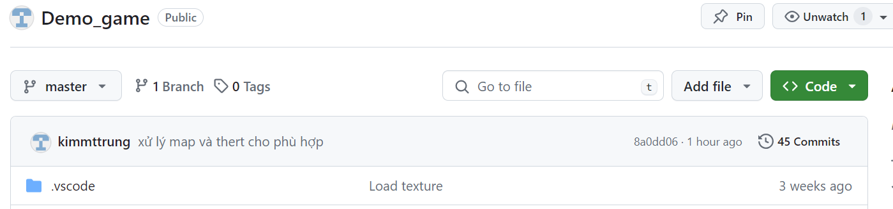

## Bước 2: Chọn Code và sao chép địa chỉ link
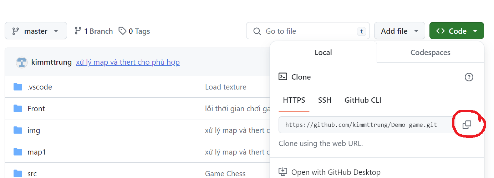

## Bước 3: Clone link về máy tính của bạn

+ Di chuyển đến thư mục nơi bạn muốn lưu file
+ Sử dụng lệnh `git clone` với URL kho lưu trữ để tạo bản sao cục bộ của kho lưu trữ:

### `Ví dụ`: git clone https://github.com/kimmttrung/Demo_game.git 

# 4. Hướng dẫn chơi
## Cách 1:
- Bước 1: Cài mingw. Ở đây mình đang dùng bản [MinGW-W64 GCC-13.2.0](https://sourceforge.net/projects/mingw-w64/files/Toolchains%20targetting%20Win32/Personal%20Builds/mingw-builds/8.1.0/)

- Bước 2: Mở file bằng Visual studio Code
- Bước 3: Mở Terminal lên chọn New Terminal
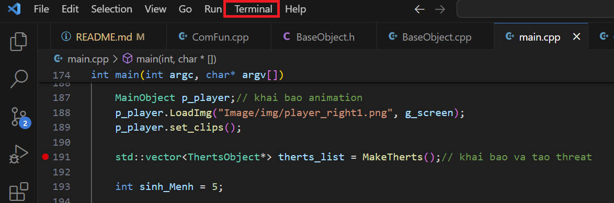
- bước 4: gõ lệnh: `./main` và đợi 3s và chúng ta sẽ bắt đầu vào game

## Cách 2:
- Sau khi tải về xong bạn vào file đã tải và chọn file `main.exe` để chơi lun
## Menu game
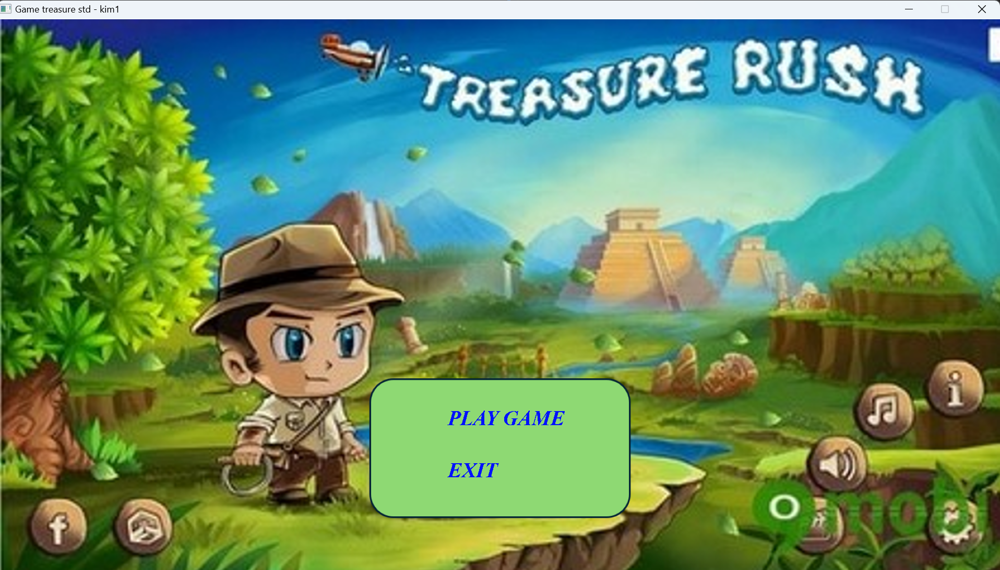
- PLAY GAME: để bắt đầu chơi
- EXIT: để thoát game or bạn có thể nhấn `ESC` or `X` bên phải màn hình

## Các thao tác chơi  
|Tên|Chức năng|            
|----|-----|
| Phím A  | Di chuyển Trái|
| Phím D  | Di chuyển Phải|
| Phím W  | Nhảy|
| Phím S  | Đạn tên lửa|
| Chuột Trái  | Đạn Sao|
| Chuột Phải  | Đạn Thường|

# 5. Các thành phần trong game
## Nhân vật chính

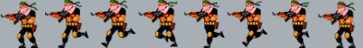
- Nhân vật sẽ di chuyển tiêu diệt quái vật và tránh những vùng nguy hiểm
- đồng thời ăn vàng và kìa khóa để mở kho báu và `Win Game`
## Các đối tượng 
- Background

- Tĩnh

|Ảnh|Tên|Chức năng|            
|--------|-----|----|
||Ô Trống |Di chuyển qua|
|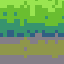|Đất| đứng trên đó|
||Đồng xu|Tăng tiền|
|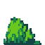|Cây|Xinh động|
||Nước|Nguy hiểm 1|
|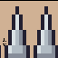|Cọc|Nguy hiểm 2|
||Thùng|Đứng trên đó|
|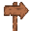|Di chuyển|Hướng dẫn người chơi|
||Kho báu|Win|
||Key|Mở cửa|
|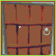|Cửa|Chặn không cho đi qua|
||Táo|Năng lượng|

- Động

|Ảnh|Tên|Chức năng|            
|--------|-----|----|
||Đạn Tên lửa|Bắn trái phải|
||Đạn thường|Bắn trái phải|
||Đạn sao|Bắn chéo xuống trái phải|
||Đạn quái|Tiêu diệt người chơi|
|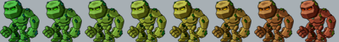|Boss 1|Tiêu diệt người chơi|
|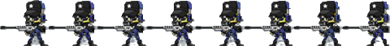|Boss 2|Tiêu diệt người chơi|
||Boss 3|Tiêu diệt người chơi|

# 6. Chiến thắng và thất bại
## Win
- Để win chúng ta cần thu thập chìa khóa để mở cửa và lấy kho báu
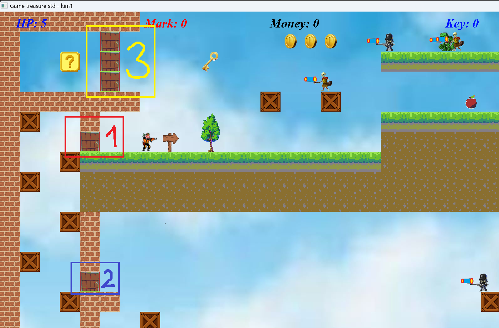
- cửa 1: cần 1 KEY để mở
- cửa 2: cần 2 KEY để mở
- cửa 3: cần 3 KEY để mở
- Có cả tính điểm và số tiền được ăn
- Nếu thắng màn hình hiện `You win` và bạn nhấn OK để thoát game

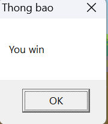
## Lose
- Giới hạn thời gian 300s và khi chạy hết thời gian mà người chơi chưa ăn được kho báu thì bị `GAME OVER`
- Va chạm quái và đạn quái bị mất 1 mạng 
- Rơi xuống nước và cọc cũng mất 1 mạng
- khi mất 1 mạng sẽ hiện 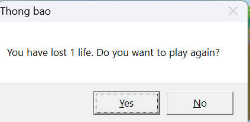 
- Chọn `YES` sẽ quay trở lại chơi và mất 1 mạng
- Chọn `NO` sẽ thoát game

# 7. Cấu trúc game
- main.cpp: 
- ComFun.cpp:
- BaseObject:
- GameMap.cpp:
- MainObject:
- Dan.cpp:
- NguyHiem:
- TextGame.cpp:
- Timer.cpp:
# Kĩ thuật lập trình
## Phát triển trên nền tảng
- Visual Studio Code
- Ngôn ngữ lập trình C++
- Thư viện SDL2 
- Extension của SDL2:
	- SDL2_Image: Hỗ trợ xử lý hình ảnh 
	- SDL2_Mixer: Hỗ trợ xử lý âm thanh
	- SDL2_TTF: Hỗ trợ xử lý font

## 8. Các kĩ thuật lập trình
- Vòng lặp, cấu trúc rẽ nhánh,...
- Con trỏ, vector, string,...
- Class, struct, kế thừa, hàm ảo,...
- Đọc viết file: fstream
- Tách file quản lý code
- Kỹ thuật duyệt mảng, sinh số ngẫu nhiên
- Các kĩ thuật, syntax của SDL
- Kĩ thuật giải phóng bộ nhớ
- Kĩ thuật xử lý thời gian 

# 9. Đồ họa
- Các texture trong game được lấy từ:
	- Map [itch.io](https://itch.io/)
	- Hình ảnh nhân vật chính và quái [Đây](https://www.youtube.com/redirect?event=video_description&redir_token=QUFFLUhqblRianROTHRXOW9IMXNNYXRKLWNrY3VadjQ5Z3xBQ3Jtc0ttVHloNWVQcjI3d2ZQc3U2T3U2Y1A5WnN1eVItYW51STV6NDJrTGo5UFVpQ29zVlN5dTBJeGRZVlBSTUtVZTZCS3N0UC0xdF82akhwaFQzdS1TQ05TRFk3N0Z4ajZVZi1PaVFBcGJtcnptNVJad3psYw&q=http%3A%2F%2Fphattrienphanmem123az.com%2Fresource&v=mv3LJCB9JJM)
	- Hình ảnh [Map](https://www.youtube.com/redirect?event=video_description&redir_token=QUFFLUhqbjU5RFFDOFBWNzdfc1l5Qjl5YVlIbFlHWTV5d3xBQ3Jtc0ttWk9aRjRKSVNUcVZVMWFHUnBLRk9fWFpOVU8weDhrVUQzU244TWw4bjl3bmh5MjdHUVd3WTFwUVBhVXA5VVdGODBYTVpUS052M3VQMUJaYTQ4ZEVWMUZWdHBDd3VJM3JHUDZuN2s0NXFfbENGU09UOA&q=http%3A%2F%2Fwww.mediafire.com%2Ffile%2Fb3u640qz5dhku33%2Fmap.rar%2Ffile&v=jOKOU9_jvEA)
	- Hình ảnh [Background](https://www.google.com/search?q=bachground+tr%E1%BB%9Di&rlz=1C1ONGR_enVN1094VN1094&oq=bachground+tr%E1%BB%9Di&gs_lcrp=EgZjaHJvbWUyBggAEEUYOTIJCAEQABgNGIAEMgkIAhAAGA0YgAQyCQgDEAAYDRiABDIJCAQQABgNGIAEMgkIBRAAGA0YgAQyCQgGEAAYDRiABDIJCAcQABgNGIAEMggICBAAGBYYHjIICAkQABgWGB7SAQg2NDA3ajBqN6gCALACAA&sourceid=chrome&ie=UTF-8#vhid=FlXzvkqPC02lKM&vssid=l)
	
- Các hình ảnh còn lại là bản thân mình tự làm sao cho phù hợp với game
- Sử dụng công cụ để vã ảnh: `Tile` và `Aseprite`
# 10. Nguồn tham khảo
- Các syntax SDL cơ bản: [Lazyfoo](https://lazyfoo.net/tutorials/SDL/)
- Map, character: [Phát Triển Phần Mềm 123A-Z](https://www.youtube.com/@PhatTrienPhanMem123AZ)

 