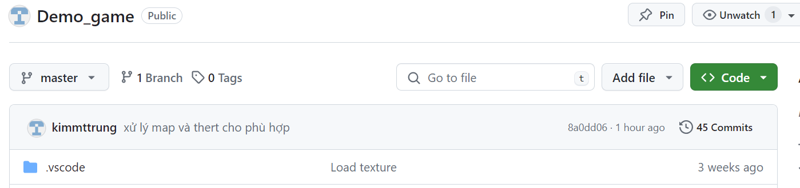
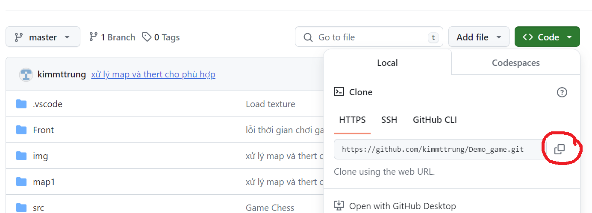

# **Dự án bài tập lớn: Game Treasure**

### Họ và tên: MAi Tấn Trung 
- MÃ Sinh Viên: 23020713
- Lớp: K68J - INT2215 52
- Trường Đại học Công Nghệ, Đại học Quốc gia Hà Nội (UET - VNU)

# 1. Giới thiệu game

- Trò chơi bắn súng tìm kho báu là một thể loại game hấp dẫn kết hợp giữa hành động bắn súng và mạo hiểm tìm kiếm kho báu. 

- Các trò chơi này thường đưa người chơi vào những cuộc phiêu lưu đầy thử thách, nơi bạn cần sử dụng cả kỹ năng chiến đấu và khả năng giải đố để tìm kiếm kho báu

# 2. Cách tải game
## Bước 1: Bạn truy cập link github: https://github.com/kimmttrung/Demo_game

## Bước 2: Chọn Code và sao chép địa chỉ link

## Bước 3: Clone link về máy tính của bạn

+ Di chuyển đến thư mục nơi bạn muốn lưu file
+ Sử dụng lệnh `git clone` với URL kho lưu trữ để tạo bản sao cục bộ của kho lưu trữ:

### `Ví dụ`: git clone https://github.com/kimmttrung/Demo_game.git 

# 3. Cách chơi

## Các thao tác chơi  
|Tên|Chức năng|            
|----|-----|
| Phím A  | Di chuyển Trái|
| Phím D  | Di chuyển Phải|
| Phím W  | Nhảy|
| Phím S  | Đạn tên lửa|
| Chuột Trái  | Đạn Sao|
| Chuột Phải  | Đạn Thường|

 